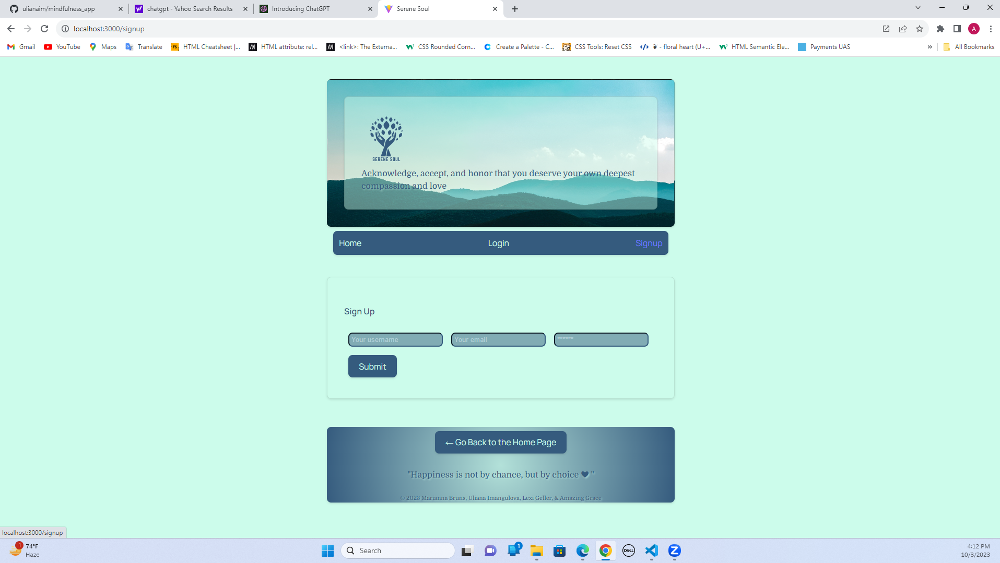
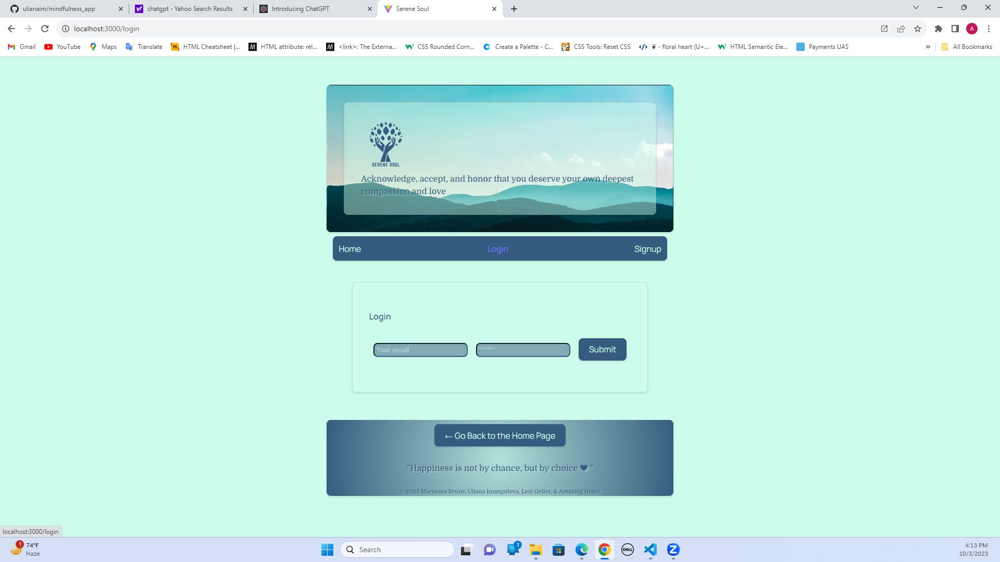
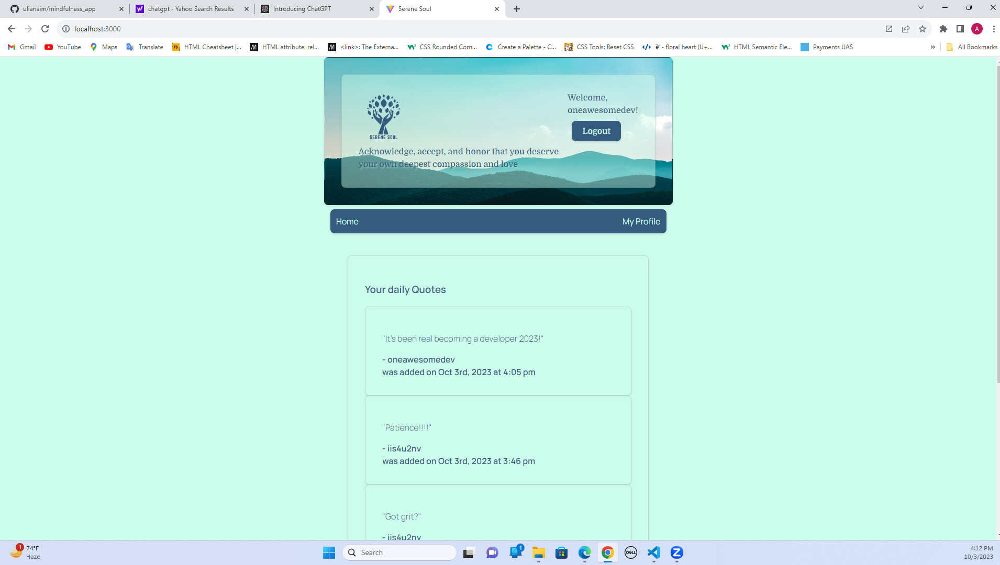
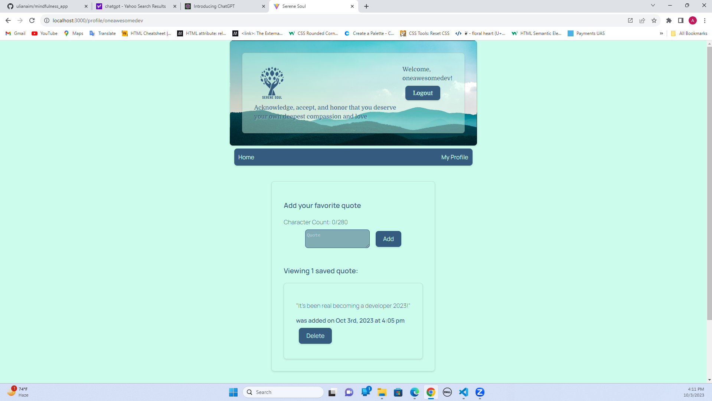

# mindfulness_app


[](https://opensource.org/licenses/MIT)


## Table of Contents
- [Description](#description)
- [Heroku Deployment](#heroku)
- [Contributing](#contributing)
- [References](#references)
- [Questions](#questions)
- [License](#license)


## User Story

```
As an avid serene soul mind
I WANT to bring peace and calm into my life
SO THAT i can have daily reminders to motivate me
I want to search for new quotes; as well as create new ones
so that I can keep a list of quotes to read every day

```


## Acceptance Criteria

```
GIVEN a mindfulness application
WHEN I load the serene soul page
THEN I am presented with clickable Home, Login, and Signup link options
WHEN I click on the Signup link option 
THEN I am presented with several input areas for username, email and password to input accordingly
WHEN I click on the Login link option 
THEN I am presented with several input areas for email and password to input accordingly
WHEN I am logged in 
THEN I am presented my profile and my saved daily quotes
WHEN I click my profile
THEN I presented with the option to add a quote, view saved quotes, and delete a quote
WHEN I add a quote that I like
THEN I am presented with the saved quotes in my profile saved quotes
WHEN I click on a delete button
THEN I am presented with all my saved quotes except the one I deleted 
WHEN I  click on the Go Back to the Home Page button
THEN the home page gets presented so the I can view my daily quotes
WHEN I click logout 
THEN I am presented with the home page and not my profile page anymore
```


## Heroku Deployment

Deployed App: https://fast-crag-82231-d0ecbeff422b.herokuapp.com/

## Contributing

If you would like to contribute as a developer, you can submit a pull request. Before starting any substantial work, it's recommended to open an issue to discuss your proposed changes with the lead developer.


# Screenshots

## Next screenshots will create understanding of the website's functionality.





 
## References

1. <a href = https://www.w3schools.com/>W3Schools</a>


2. <a href = https://stackoverflow.com/>Community Forums & Stack Overflow</a>


3. <a href =https://expressjs.com/>Express.js</a>


4. <a href =https://create-react-app.dev/docs/making-a-progressive-web-app>Making a progressive Web App</a>


5. <a href =https://www.apollographql.com/tutorials/fullstack-quickstart/04-writing-query-resolvers/>Apollographql</a>


6. [Learn the MERN Stack YouTube](https://www.youtube.com/playlist?list=PLillGF-RfqbbiTGgA77tGO426V3hRF9iE)


7. <a href =https://www.sitepoint.com/react-router-complete-guide/>React router complete guide</a>


8. <a href =https://dev.to/>DEV Community</a>


9. <a href =https://calendly.com/d/dnc-wpf-c7s>UCF Tutors</a>


10. <a href =https://developer.mozilla.org/en-US/docs/Glossary/MVC>MDN Web Docs</a>


11. <a href =https://coding-boot-camp.github.io/full-stack/mongodb/deploy-with-heroku-and-mongodb-atlas>Deploying</a>


## Questions


For any questions, please contact us:


GitHub: [uliamaim](https://github.com/ulianaim/mindfulness_app)


Collaborators Emails:
1. [Uliana Imangulova](https://github.com/ulianaim)
2. [Marianna Bruns](https://github.com/marbfree)
3. [Amazing Grace](https://github.com/iis4u2nv)
4. [Lexi Geller](https://github.com/lexigeller)

## License


This project is licensed under the MIT License.